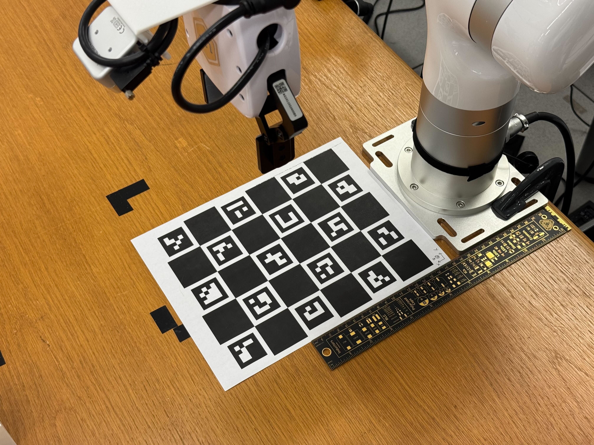

# XarmGelloTeleop

## Calibrate and Teleoperate XArm with Gello

- Make sure all cameras are connected to the workstation. Put the calibration board on the table at the **exact** same location and orientation as the following image shows. For bimanual settings, put the second calibration board in the same way next to the second robot's base so you have two calibration boards on the table. You can check whether the calibration board is visible in all camera views by running Realsense Viewer: ```realsense-viewer```.


- Calibrate robot: ```python experiments/real_world/calibrate.py --calibrate``` or ```python experiments/real_world/calibrate.py --calibrate_bimanual```. This will save the calibration results to log/latest_calibration automatically and overwrite previous calibration results, unless you manually back them up in ```log/old_calibration``` before re-calibration.
- Remove the calibration board and prepare the data collection setup (i.e. put the object into the robot workspace). Depending on whether you are doing bimanual or not, run ```python experiments/real_world/teleop.py --name exp_name/recording_1``` or ```python experiments/real_world/teleop.py --bimanual --name exp_name/recording_1```. This will make the robot enter keyboard teleoperation mode and camera enter recording mode. The results are logged in ```log/data/exp_name/recording_1```. The calibration result gets copied to the same directory. The intrinsics are updated to be the new intrinsics at the time of recording.
- Run ```python experiments/real_world/teleop_postprocess.py``` before ensuring you have the desired experiment name selected and desired output dir specified in the python file. The ```match_timestamps()``` function will automatically match camera recordings and robot action recordings.
- The final data format is as follows:
```
experiments/log/data/{exp_name_processed}
    - episode_0
        - timestamps.txt  # (4, T) array, stores the timestamps of all frame captures for each camera
        - calibration  # stores all calibration data
        - robot  # each frame is a .txt file. See the [Robot data format] subsection below for details
        - camera_0
            - rgb
            - depth
        - camera_1
        ...
    - episode_1
    ...
```

## Robot data format
the format of the robot action recordings in the "robot" directory of each episode is shown in the following example. Suppose you read ```.../robot/000032.txt``` (32 indicates that it is the 32nd frame), and get:
```
2.452557454592828867e-01 1.335977201187219521e-01 -2.521867577505014779e-01
9.866812923698686788e-01 -1.655098169018322588e-02 1.618211738074379347e-01
1.741193032580600278e-02 9.998407807561483507e-01 -3.903564943105270954e-03
-1.617308009306053229e-01 6.669193506488074047e-03 9.868123782605880967e-01
8.010000000000000000e+02 0.000000000000000000e+00 0.000000000000000000e+00
```
Then this is a robot action data for a single arm setting (can be seen from the array shape: it is 5x3). For bimanual settings, the data array will be 9x3:
```
2.136089501477752561e-01 1.078466342027486757e-01 -2.122918765257859053e-01
9.918209213438885508e-01 2.053222188677339410e-02 1.259749492913271596e-01
-1.789639705830776278e-02 9.995973443262174962e-01 -2.201972271180294149e-02
-1.263763385958444896e-01 1.958512395583956317e-02 9.917890118179082393e-01
1.521069999999999922e-01 8.468849999999999989e-01 -2.303379999999999872e-01
9.996493272234043825e-01 2.593762948172344263e-02 5.334975038727044622e-03
-2.597538064658756751e-02 9.996371343833311274e-01 7.132963069223780331e-03
-5.148027006523361176e-03 -7.269039740629919949e-03 9.999603286526866919e-01
8.004808281787613851e+02 8.400000000000000000e+02 0.000000000000000000e+00
```
For a 5x3 array (single arm), the first row is the 3D translation of the robot gripper in the world frame (defined by the calibration board during calibration). Row 2, 3, and 4 (a 3x3 subarray) is the rotation matrix of the robot gripper with respect to a canonical gripper pose. Row 5 is the gripper openness. The first column indicates the openness of the gripper (0: close, 800: maximum openness), and the rest two columns are all-zero paddings.

For a 9x3 array, row 1-4 together represents the 3D translation and rotation of the first robot's gripper; row 5-8 together represents the 3D translation and rotation of the second robot's gripper. Row 9 represents the openness of the two grippers: first column = first robot, second column = second robot, third column = all-zero padding.

## Sample Data

Download the sample data and practice using it in your codebase:
|  Task  |     Link    |
|:--------:|:-------------:|
| Cube Picking (single arm, 4 fixed cameras, 15 episodes)     |      https://drive.google.com/file/d/1Fu0rFZeQpXT-WBUqyh1KN58j0EfidB9u/view?usp=sharing      |